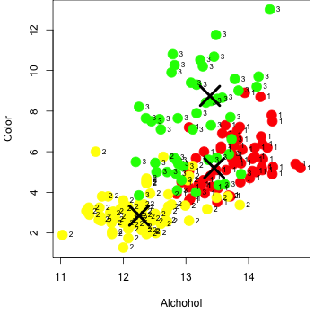
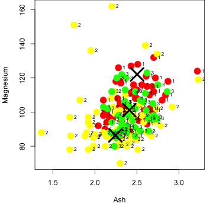

## K-Means Clustering as a Exploratory Data Analysis Tool
### What is it?
In the following slides I will show why <a href="https://jakeharmon.shinyapps.io/kmeans-app/">this shiny app</a>, created by me, might be useful to some.

K-Means clustering takes predictors and tries to group them without knowing anything about them.

It is a method of unsupervised machine learning.  

All of the following examples use the <a href="http://www.inside-r.org/packages/cran/rattle/docs/wine">rattle.wine</a> dataset.

--- .class #id 
## K-Means Clustering ...
### Why Does it Matter?
In this example we will show how it can be used interactively to see how well K-Means defines clusters using pairs of predictors.

By giving a data scientist tools to do exploratory data analysis, it might help them to zero in and select the most meaningful predictors.

While K-Means can work in many more dimensions than 2, to idea here is to give the user a way to visualize outcomes in 2 dimensions.

--- .class #id
## K-Means Clustering ...
### Example 1 - Alchohol and Color
Below shows how K-Means using only Alchohol content and Color can be a fairly decent predictor of which type of grape.  The labels next to the color identify the truth for which variety, as a numerical factor.

 

--- .class #id
## Grape Variety and K-Means Clustering
###  Example 2 - Ash and Magnesium
But Ash and magnesium are not.

 

--- .class #id
## K-Means Clustering ...
### Conclusion
I urge you to play with <a href="https://jakeharmon.shinyapps.io/kmeans-app/">My App</a>
to get an idea of how K-Means clustering might help to pick out predictors in other machine learning tasks.

